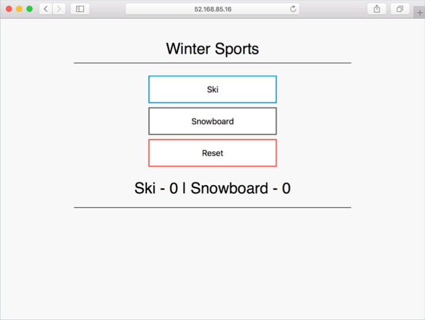

# azure-vote

The Azure Vote application is a simple sample used throughout the Azure Container Service (AKS) documentation. This example demonstrates the Azure vote application with Azure Redis using the Kubernetes Open Service Broker for Azure (OSBA).
## Installing the Chart

Add the Azure Samples chart repository.

```
helm repo add azure-samples https://azure-samples.github.io/helm-charts/
```

Install the chart.

```
helm install azure-samples/azure-vote-osba
```

## Configuration

The following tables lists the configurable parameters of the azure-vote chart and the default values.

| Parameter | Description | Default |
|---|---|---|
| title | Azure vote app title. | Azure Vote App |
| value1 | Value for first vote controll / value | Cats |
| value2 | Value for second vote controll / value | Dogs |
| serviceName | Name for Kubernetes service. | aks-helloworld |
| serviceType | Type for Kubernetes service. | LoadBalancer |

## Examples

```
helm install azure-samples/azure-vote-osba
```


```
helm install azure-samples/azure-vote-osba --set title="Winter Sports" --set value1=Ski --set value2=Snowboard
```




